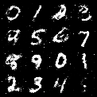

# Pantheon Lab Programming Assignment

## Submission Summary

This repository contains a conditional MNIST GAN implemented with Hydra and PyTorch Lightning. The completed run uses the native 28×28 MNIST resolution, GPU acceleration when available, WandB experiment tracking, and Lightning 2.x manual optimization for the generator/discriminator pair.

### Completed implementation

- Completed the generator and discriminator Hydra configuration.
- Implemented the shared GAN `step()` method and both generator/discriminator losses.
- Added Lightning 2.x manual optimization for the two-optimizer GAN.
- Implemented validation and test steps.
- Added WandB loss logging and generated-image logging at the end of each training epoch.
- Configured WandB as the default logger; use `logger=null` for a run without experiment tracking.
- Added a 20-epoch training horizon and validation every five epochs.
- Added GPU, mixed-precision, native-resolution, batch-size, data-loading, and pinned-memory optimizations.

### Training output

The completed run is tracked in the WandB `Tests` project. The local run artifact is `logs/wandb/run-20260723_202820-r60lag0d/` with run ID `r60lag0d`.

Run summary:

| Item | Result |
|------|--------|
| Hardware | NVIDIA GeForce RTX 5070 Ti |
| Python | 3.14.3 |
| Epochs | 20 (`epoch` 0–19) |
| Global step | 8,599 |
| Runtime | 1,329 seconds |
| Trainable parameters | 2,444,377 |
| Final `train/g_loss` | 0.4273 |
| Final `train/d_loss` | 0.1698 |
| Final `val/g_loss` | 0.5748 |
| Final `val/d_loss` | 0.1634 |

The run records step-level and epoch-level loss curves, epoch-level validation/test metrics, GPU/system metrics, and 16-image conditional sample grids under `gen_imgs`. The final sample grid is captioned `epoch_19` and shows recognizable digits with visible noise, which is expected from this small fully connected GAN. A convolutional DCGAN-style architecture would be the next improvement for sharper samples.

Included sample output:



### Challenges and fixes

- **Python 3.14 and Hydra:** upgraded Hydra from the 1.3 release to the Hydra development version from GitHub because of the `LazyCompletionHelp`/`argparse` incompatibility.
- **Hydra composition:** added `_self_` and corrected parent-relative OmegaConf interpolations such as `${..n_classes}`.
- **Lightning 2.x compatibility:** replaced `LightningLoggerBase` with `Logger`, migrated deprecated Trainer options, handled nullable loggers, and used `trainer.loggers` for multiple logger instances.
- **Multiple optimizers:** enabled manual optimization and retained a shared `step()` helper for generator/discriminator loss computation.
- **Windows logging:** configured UTF-8 output to avoid GBK failures when Lightning emits Unicode messages.
- **Runtime behavior:** implemented `test_step`, prevented invalid checkpoint selection during testing, skipped sample generation when WandB is disabled, and finalized loggers with success/failed status even when a run raises an exception. WandB is explicitly closed with `wandb.finish(exit_code=...)` and uses a bounded 60-second shutdown timeout.

Detailed notes are available in [`challenges.md`](challenges.md) and [`training.md`](training.md).

## Answers

### GAN Model Questions

#### 1. Role of the discriminator in a GAN model

The discriminator is a binary classifier that distinguishes real images
from the dataset from fake images produced by the generator. In this
implementation it returns a scalar score for each image-label pair.
Because the model uses `MSELoss` with least-squares GAN targets, the
score is trained toward 1 for real images and 0 for generated images;
it is not passed through a sigmoid and should not be interpreted as a
calibrated probability.

In this MNIST GAN project, the discriminator takes a 28×28 grayscale
image together with its digit label. During training it sees real MNIST
images and fake images from the generator. The generator tries to make
the discriminator assign generated images a real target score. This
adversarial feedback is the core of conditional GAN training.

#### 2. Generator inputs `noise` and `labels`

| Input | Description |
|-------|-------------|
| `noise` | Random latent vector from a standard normal distribution. Provides randomness so each run produces a different-looking digit. |
| `labels` | Conditional class label (0–9) telling the generator which digit to produce. Passed through an embedding or one-hot encoding. |

To generate the number 5 at inference time:

1. Sample a noise vector from N(0, 1), e.g. 100 dimensions.
2. Set the label to 5.
3. Feed both noise and label into the generator.
4. The generator outputs a 28×28 image of the digit "5".

This is standard inference for a Conditional GAN (CGAN), where the
label controls the class of the generated output.

#### 3. Steps to deploy a model into production

| Step | Description |
|------|-------------|
| Model Export | Convert the trained model to a deployment-friendly format such as TorchScript, ONNX, or a checkpoint. |
| Inference Optimization | Apply quantization, pruning, or acceleration frameworks such as TensorRT or vLLM to reduce latency. |
| API Wrapping | Expose the model via a REST API with FastAPI/Flask, or gRPC for high-performance serving. |
| Containerization | Package with Docker for environment consistency across development, staging, and production. |
| Deployment | Deploy to Kubernetes, AWS Lambda, or cloud VMs with auto-scaling configured. |
| Monitoring and Logging | Track inference latency, throughput, error rates, and configure alerts. |
| Versioning | Use MLflow or DVC for model version control, enabling A/B testing and rollback. |

#### 4. Multi-GPU data allocation in PyTorch Lightning

PyTorch Lightning handles most device placement automatically:

| Area | How Lightning Handles It |
|------|--------------------------|
| Distributed Init | Set `accelerator="gpu"`, `devices=N`, and a strategy such as `strategy="ddp"`. Lightning initializes the process group. |
| Model and Loss | `self` (the model) is moved to the correct device automatically. No manual `.to(device)` calls are needed. |
| Data | In `training_step`, the `batch` is already on the correct GPU. |
| Manual Tensors | Create tensors on the fly with `self.device`: `torch.randn(batch_size, latent_dim, device=self.device)`. |
| Cross-GPU Sync | Use `self.all_gather()` to aggregate tensors across multiple GPUs. |

Lightning abstracts away low-level distributed training details, letting
you focus on the research logic rather than device management.

### LLM Questions

#### 1. Model comparison on content, context, fluency, and ethics

Three models were evaluated through LM Studio and scored by
DeepSeek V4 Pro. Full candidate responses are in `llm-test/results/`
and structured scores in `llm-test/judge-results/`.

All models were evaluated on the same hardware (RTX 5070 Ti) through
LM Studio's OpenAI-compatible API. DeepSeek V4 Pro served as an
independent blind judge using a fixed 1–5 rubric with temperature 0
for determinism.

| Model | Content | Context | Fluency | Ethics |
|---|---:|---:|---:|---:|
| Qwen3.5 4B (Q4\_K\_M) | 4.4 | 4.4 | 5.0 | 5.0 |
| Qwen3.5 9B (Q4\_K\_M) | 4.2 | 4.2 | 4.8 | 5.0 |
| GPT-OSS 20B (MXFP4) | 2.4 | 4.2 | 4.8 | 4.2 |

Key findings:

- All three models score strongly on fluency and ethics for most
  prompts.
- The technical backpropagation prompt is the hardest discriminator:
  all models scored 1–2 on content quality there, with GPT-OSS 20B
  performing worst.
- GPT-OSS 20B scored lower on ethics (3/5 for the political
  astroturfing prompt), while both Qwen3.5 models received 5/5
  across safety prompts.
- The 4B Qwen3.5 slightly outperformed the 9B variant because the
  9B response was cut short by the 2048-token limit on the technical
  prompt.

Methodology: each model received the same five prompts with identical
parameters (temperature 0.7, max\_tokens 2048). Responses were saved
as Markdown and scored by a blind DeepSeek V4 Pro judge using a fixed
rubric. The judge was excluded from the candidate set and had no
access to model identities. See `llm-test/main.py` for the harness
and `llm-test/prompts/judge.txt` for the rubric.

---

#### 2. Parameters that control model responses

| Parameter | Effect |
|-----------|--------|
| Temperature | Scales logits before softmax. Low (0.0–0.3): deterministic. High (0.7–1.5): creative but may hallucinate. |
| Top-p (Nucleus Sampling) | Samples from the smallest token set with cumulative probability ≥ p. Low values produce focused, safe output; high values add variety. |
| Top-k | Limits sampling to k most likely next tokens. Less common than top-p in current practice. |
| Max Tokens | Caps total output length including input. Prevents runaway responses and controls cost. |
| Stop Sequences | Strings that halt generation immediately. Useful for structured outputs and section breaks. |
| Frequency Penalty | Penalizes tokens based on how often they have appeared. Positive values reduce repetition. |
| Presence Penalty | Penalizes tokens that have appeared at all. Positive values encourage the model to explore new topics. |

#### 3. Prompt engineering techniques

| Technique | Description | Example | Challenges |
|-----------|-------------|---------|------------|
| Template-Based | Predefined prompt structures with placeholders. | Summarize an article in bullet points using `{article_text}`. | Templates can be rigid; they require anticipating all input variations. |
| Rule-Based | Prompts with explicit constraints or formatting rules. | Answer only "Yes" or "No" with no explanation. | Rules may be ignored; conflicting rules confuse the model. |
| ML-Based (Soft Prompting) | Trainable prompt embeddings optimized via gradient descent. | Prefix tuning with a frozen LLM. | Requires training data and compute; less interpretable than hand-crafted prompts. |

Key design considerations:

- Clarity: be explicit about format, tone, and scope.
- Specificity: include concrete constraints.
- Context relevance: provide background without overwhelming the model.
- Iterative refinement: test, evaluate, and iterate.
- Bias awareness: prompts can inadvertently steer toward biased
  responses.

#### 4. Retrieval-Augmented Generation (RAG) in NLG

RAG combines a retriever with a generator:

| Component | Role |
|-----------|------|
| Retriever | Indexes a corpus and fetches top-k relevant passages via semantic or keyword search. |
| Generator | Receives the query plus retrieved passages as context, then generates a grounded response. |

Applications:

| Task | How RAG Helps |
|------|---------------|
| Question Answering | Reduces hallucination and improves factual accuracy. |
| Summarization | Produces summaries grounded in source material. |
| Dialogue / Chatbots | Pulls from knowledge bases for domain-specific queries. |
| Code Generation | Retrieves documentation or examples before generating solutions. |

RAG's key advantage: it decouples knowledge, stored in an updatable
index, from reasoning handled by the LLM, enabling factual and
domain-specific responses without fine-tuning.

<div align="center">

## Original Project Description

<a href="https://pytorch.org/get-started/locally/"></a>
<a href="https://pytorchlightning.ai/"></a>
<a href="https://hydra.cc/"></a>
<a href="https://github.com/ashleve/lightning-hydra-template"></a><br>

</div>

## What is all this?
This "programming assignment" is really just a way to get you used to
some of the tools we use every day at Pantheon to help with our research.

There are 4 fundamental areas that this small task will have you cover:

1. Getting familiar with training models using [pytorch-lightning](https://pytorch-lightning.readthedocs.io/en/latest/starter/new-project.html)

2. Using the [Hydra](https://hydra.cc/) framework

3. Logging and reporting your experiments on [weights and biases](https://wandb.ai/site)

4. Showing some basic machine learning knowledge

## What's the task?
The actual machine learning task you'll be doing is fairly simple! 
You will be using a very simple GAN to generate fake
[MNIST](https://pytorch.org/vision/stable/datasets.html#mnist) images.

We don't excpect you to have access to any GPU's. As mentioned earlier this is just a task
to get you familiar with the tools listed above, but don't hesitate to improve the model
as much as you can!

## What you need to do

To understand how this framework works have a look at `src/train.py`. 
Hydra first tries to initialise various pytorch lightning components: 
the trainer, model, datamodule, callbacks and the logger.

To make the model train you will need to do a few things:

- [x] Complete the model yaml config (`model/mnist_gan_model.yaml`)
- [x] Complete the implementation of the model's `step` method
- [x] Implement logging functionality to view step/epoch loss curves and generated samples during training using the Lightning `on_train_epoch_end` hook and [Weights & Biases](https://wandb.ai/site). WandB is enabled by default; use `logger=null` to disable it.
- [x] Answer the GAN and deployment questions below
- [ ] Run and document the external three-model LLM comparison below

**All implementation tasks in the code are marked with** `TODO`

Don't feel limited to these tasks above! Feel free to improve on various parts of the model

For example, training the model for around 20 epochs will give you results like this:


## Getting started
After cloning this repo, install dependencies
```yaml
# [OPTIONAL] create conda environment
conda create --name pantheon-py38 python=3.8
conda activate pantheon-py38

# install requirements
pip install -r requirements.txt
```

Train model with experiment configuration
```yaml
# default (GPU)
python run.py experiment=train_mnist_gan.yaml

# train on CPU
python run.py experiment=train_mnist_gan.yaml trainer.accelerator=cpu

# train on GPU
python run.py experiment=train_mnist_gan.yaml trainer.accelerator=gpu trainer.devices=1
```

You can override any parameter from command line like this
```yaml
python run.py experiment=train_mnist_gan.yaml trainer.max_epochs=20 datamodule.batch_size=32
```

The generator and discriminator are configured in `configs/model/mnist_gan_model.yaml`. The model uses Lightning 2.x manual optimization because GAN training requires two optimizers.

## Open-Ended tasks (Bonus for junior candidates, expected for senior candidates)

Staying within the given Hydra - Pytorch-lightning - Wandb framework, show off your skills and creativity by extending the existing model, or even setting up a new one with completely different training goals/strategy. Here are a few potential ideas:

- **Implement your own networks**: you are free to choose what you deem most appropriate, but we recommend using CNN and their variants if you are keeping the image-based GANs as the model to train
- **Use a more complex dataset**: ideally introducing color, and higher resolution
- **Introduce new losses, or different training regimens**
- **Add more plugins/dependecy**: on top of the provided framework
- **Train a completely different model**: this may be especially relevant to you if your existing expertise is not centered in image-based GANs. You may want to re-create a toy sample related to your past research. Do remember to still use the provided framework.

## Questions

Try to prepare some short answers to the following questions below for discussion in the interview.

* What is the role of the discriminator in a GAN model? Use this project's discriminator as an example.

* The generator network in this code base takes two arguments: `noise` and `labels`.
What are these inputs and how could they be used at inference time to generate an image of the number 5?

* What steps are needed to deploy a model into production?

* If you wanted to train with multiple GPUs, 
what can you do in pytorch lightning to make sure data is allocated to the correct GPU? 

## Submission

- Using git, keep the existing git history and add your code contribution on top of it. Follow git best practices as you see fit. We appreciate readability in the commits
- Add a section at the top of this README, containing your answers to the questions, as well as the output `wandb` graphs and images resulting from your training run. You are also invited to talk about difficulties you encountered and how you overcame them
- Link to your git repository in your email reply and share it with us/make it public

# Chatbot Assignment:

To complete this assignment, please use any LLM evaluation platform or tool you are familiar with — or simply try with [Poe](https://poe.com/) — to test different models, capture their responses, and document your findings.

* Compare atleast 3 different models and provide insights on Content Quality, Contextual Understanding, Language Fluency and Ethical Considerations with examples.

* What are the parameters that can be used to control response. Explain in detail.

* Explore various techniques used in prompt engineering, such as template-based prompts, rule-based prompts, and machine learning-based prompts and provide what are the challenges and considerations in designing effective prompts with examples.

* What is retrieval-augmented generation(RAG) and how is it applied in natural language generation tasks?

<br>
